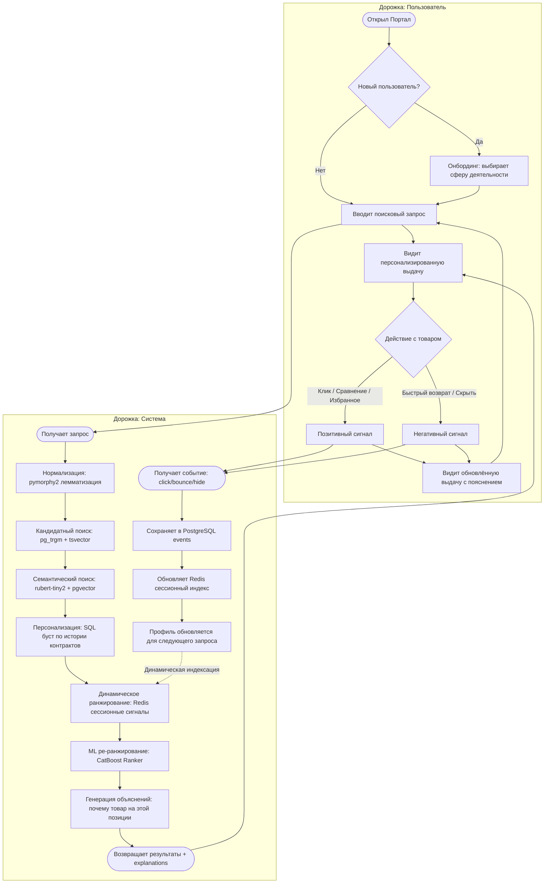

# Схема реализации BPMN

Две дорожки: **Пользователь** и **Система**.

## Диаграмма (Mermaid)

## Описание для презентации

### Дорожка пользователя

1. **Открыл Портал** — пользователь заходит на сервис.
2. **Онбординг** (только новые) — выбирает сферу деятельности для решения проблемы холодного старта.
3. **Вводит запрос** — поисковая строка с автодополнением (pg_trgm, <50 мс).
4. **Видит персонализированную выдачу** — карточки СТЕ с бейджами объяснимости.
5. **Взаимодействует** — клики, сравнение, избранное (позитивные сигналы) или быстрый возврат и «скрыть» (негативные).
6. **Видит изменение выдачи** — следующий запрос учитывает действия в этой сессии + отображается причина изменения.

### Дорожка системы

1. **Нормализация** — `pymorphy2` приводит запрос к начальным формам: «ноутбуков» → «ноутбук».
2. **Кандидатный поиск** — pg_trgm (fuzzy matching, опечатки) + tsvector (полнотекстовый Russian).
3. **Семантический поиск** — `rubert-tiny2` строит эмбеддинг запроса, находит ближайших соседей в pgvector.
4. **Персонализация (SQL)** — буст для СТЕ из истории контрактов + категорийный аффинитет.
5. **Динамическое ранжирование** — Redis выдает дельты оценок по событиям текущей сессии (<1 мс).
6. **CatBoost Ranker** — финальное ML ре-ранжирование по всем признакам.
7. **Объяснимость** — каждый результат получает набор тегов-объяснений.

### Ключевое свойство: динамическая индексация

При каждом действии пользователя (клик, bounce, hide):
- Событие пишется в PostgreSQL (постоянная история).
- Redis-хэш сессии обновляется (`HINCRBY`) за <1 мс.
- Следующий поисковый запрос автоматически подтягивает эти дельты на Stage 4.
- Выдача изменяется **без перестройки индекса** — только изменение порядка.
