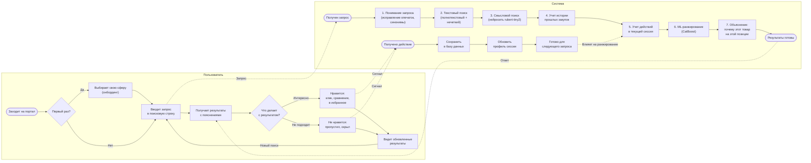

# BPMN-схема проекта

Две дорожки: **Пользователь** и **Система**.

## Диаграмма (Mermaid)

## Описание для презентации

### Что делает пользователь

1. **Заходит на портал** -- открывает поисковый сервис.
2. **Онбординг** (только новые) -- выбирает свою сферу деятельности, чтобы система сразу знала, что ему нужно.
3. **Вводит запрос** -- пишет, что ищет, с подсказками в строке поиска.
4. **Получает результаты** -- видит карточки товаров с пояснениями, почему они на этих местах.
5. **Взаимодействует** -- кликает, сравнивает, добавляет в избранное (нравится) или пропускает, скрывает (не нравится).
6. **Видит улучшенные результаты** -- следующий запрос уже учитывает его поведение.

### Что делает система (7 шагов за доли секунды)

1. **Понимание запроса** -- исправляет опечатки, подбирает синонимы, приводит слова к базовой форме.
2. **Текстовый поиск** -- ищет по тексту названий с учетом опечаток и морфологии русского языка.
3. **Смысловой поиск** -- нейросеть понимает смысл запроса и находит похожие товары, даже если слова другие.
4. **Учет истории** -- поднимает выше товары из категорий, которые пользователь закупал раньше.
5. **Учет сессии** -- если пользователь только что кликнул на ноутбук, похожие товары поднимаются выше.
6. **ML-ранжирование** -- модель машинного обучения объединяет все факторы и выстраивает финальный порядок.
7. **Объяснение** -- к каждому товару добавляется пояснение: "из вашей категории", "похоже на то, что вы смотрели" и т.д.

### Главная фишка: мгновенная обратная связь

Каждое действие пользователя (клик, пропуск, скрытие) моментально влияет на выдачу:
- Действие сохраняется в базу данных (для долгосрочного профиля).
- Профиль сессии обновляется за <1 мс.
- Следующий поисковый запрос **сразу учитывает** эти действия -- без задержек и перестройки индексов.
