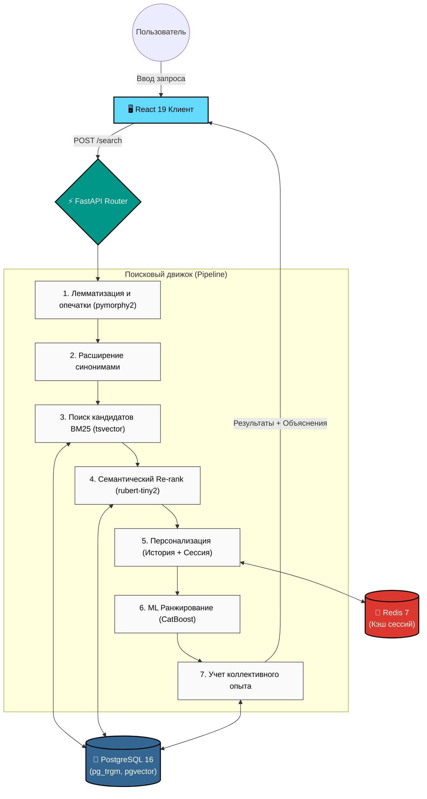

# TenderHack Moscow: Персонализированный умный поиск СТЕ

Сервис интеллектуального поиска для Портала Поставщиков (zakupki.mos.ru), разработанный в рамках хакатона TenderHack. Решение объединяет полнотекстовый поиск, семантический анализ, машинное обучение и персонализацию в реальном времени.


---

## Ключевые возможности

*   **Коллективное дообучение (Collective Learning)**: Система анализирует успешные поисковые сессии всех пользователей и автоматически адаптирует выдачу. Если пользователи часто выбирают "Упаковочная бумага" по запросу "Бумага для подарков", нейросеть запоминает эту связь и улучшает будущие результаты для всех.
*   **Глубокая персонализация**: Учет исторического профиля (закупки, контракты) и поведения в текущей сессии (клики, лайки, просмотры). Интересы динамически затухают со временем.
*   **Прозрачность ИИ (Explainable AI)**: Пользователь всегда видит, почему товар находится на определенной позиции (совпадение по тексту, семантика, влияние профиля, коллективный опыт).
*   **Семантический поиск**: Использование легковесной языковой модели `rubert-tiny2` для понимания смысла запроса, а не только точного совпадения слов.
*   **Умная обработка запросов**: Автоматическая лемматизация (`pymorphy2`), исправление опечаток, раскрытие синонимов и специфичных аббревиатур.

---

## Архитектура решения



---

## Быстрый старт

### Требования
*   Docker 24+
*   Docker Compose v2

### Запуск

```bash
git clone <repo-url>
cd TenderHackMoscow

# Подготовка датасетов
mkdir -p data
cp /path/to/ste_dataset.xlsx data/
cp /path/to/contracts_dataset.xlsx data/

# Запуск всех сервисов в фоне
make up

# Накатывание миграций БД и загрузка данных
make migrate
make load-data
```

Приложение доступно по адресу: `http://localhost`  
Документация API (Swagger): `http://localhost:8000/docs`

---

## Основные API методы

### `POST /api/v1/search`
Персонализированный поиск СТЕ с учетом контекста пользователя.

```json
{
  "query": "ноутбук",
  "user_inn": "7701234567",
  "session_id": "s_abc123",
  "limit": 20,
  "offset": 0,
  "category": "Компьютерная техника"
}
```

**Особенности ответа:**
*   `results[]` содержит `explanations[]` (почему товар на этой позиции).
*   `corrected_query` (лемматизированная форма запроса).
*   `collective_insights` (данные о том, как другие пользователи повлияли на выдачу).
*   `applied_rewrites` (примененные синонимы и расширения).

### `GET /api/v1/search/suggest?q=ноутб`
Быстрый автокомплит на базе `pg_trgm` (<50 мс).

### `POST /api/v1/events`
Логирование действий пользователя для персонализации и дообучения.
Поддерживаемые события: `click`, `like`, `dislike`, `view`, `bounce`, `hide`.

---

## Стек технологий

| Слой | Технологии | Обоснование |
| :--- | :--- | :--- |
| **Backend** | Python 3.11, FastAPI, SQLAlchemy 2.0 Async, asyncpg | Асинхронная обработка, высокая производительность |
| **База данных** | PostgreSQL 16 + pgvector + pg_trgm | Единое хранилище для реляционных данных, полнотекстового и векторного поиска |
| **Кеширование** | Redis 7 | Быстрое хранение сессий и динамических индексов |
| **NLP** | pymorphy2, symspellpy, NLTK | Быстрая лемматизация и исправление опечаток без внешних API |
| **Семантика** | rubert-tiny2 (cointegrated), FAISS | Легковесная модель для русского языка, быстрый инференс на CPU |
| **Ранжирование** | CatBoost (LTR), SHAP | Градиентный бустинг для Learning-to-Rank с возможностью интерпретации |
| **Frontend** | React 19, TypeScript, Vite 6, Tailwind CSS | Современный стек для быстрой разработки и типизации |
| **Инфраструктура** | Docker, Docker Compose, Nginx | Изолированная среда, простота развертывания |